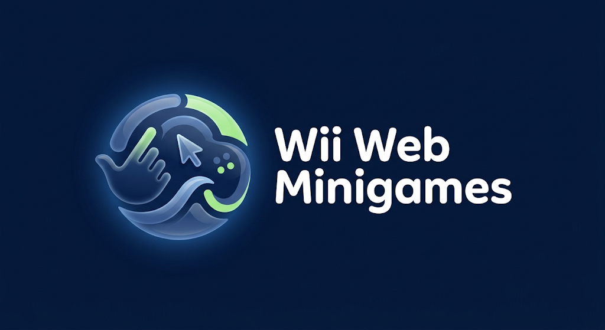

<div align="center">
  <a href="https://github.com/gabrielbaumgratz" target="_blank">
    
  </a>
  <a href="https://linkedin.com/in/gabrielbaumgratz" target="_blank">
    
  </a>
  <a href="https://instagram.com/gabrielbaumgratz" target="_blank">
    
  </a>
</div>

<div align="center">
  
</div>

<div align="center">
  <strong>🇧🇷 Português</strong> | 
  <a href="README_EN.md">🇺🇸 English</a> | 
  <a href="README_ES.md">🇪🇸 Español</a> | 
  <a href="README_DE.md">🇩🇪 Deutsch</a>
</div>
<br>

# Wii Web Videogame

Uma coletânea de mini-jogos para navegador controlada inteiramente pelo movimento do seu corpo, utilizando a sua webcam.

Nenhum hardware extra é necessário. O seu dedo atua como o mouse para a navegação e a sua mão atua como o controle durante as partidas.

---

## Como Funciona

- **Captura e Rastreamento:** O jogo acessa a sua webcam e detecta a geometria da sua mão instantaneamente.
- **Navegação (Dwell Click):** A ponta do seu dedo indicador controla o cursor do menu. Ao manter o dedo parado sobre um botão por 1.5s, o clique é acionado automaticamente.
- **Jogos Disponíveis:**
  - **Tênis 3D:** Mova a mão no eixo vertical e horizontal para alinhar a raquete em profundidade. O jogo utiliza o sistema de pontuação oficial do esporte real (15, 30, 40, Iguais e Vantagem).
  - **Moto Racer:** Desloque a mão lateralmente para guiar a motocicleta e desviar dos obstáculos na pista.
  - **Hóquei:** Defenda seu lado do campo movendo a mão na vertical para rebater o disco (Modo Solo ou Tela Dividida local).

## 🚀 Como Rodar na Sua Máquina (Passo a Passo)

Para proteger sua privacidade, navegadores (como o Chrome) bloqueiam o acesso à webcam se você tentar abrir um site apenas dando dois cliques no arquivo no seu computador. Para jogar em casa, precisamos "fingir" que o site está na internet, criando um **servidor local**. É muito fácil, basta seguir as instruções!

### Pré-requisitos
Você vai precisar de pelo menos UM dos seguintes programas instalados no seu computador. Escolha o que preferir:
- [Node.js](https://nodejs.org/pt-br) (Recomendado versão 14 ou superior)
- **OU** [Python](https://www.python.org/downloads/) (Recomendado versão 3.7 ou superior)

### Passo 1: Baixar os Arquivos
1. Baixe os arquivos do jogo (Use o botão verde **"Code" -> "Download ZIP"** no topo desta página), ou se preferir o terminal:
   ```bash
   git clone https://github.com/gabrielbaumgratz/wii-webcam-videogame.git
   ```
2. Caso tenha baixado o ZIP, extraia a pasta no seu computador.
3. Abra o terminal (Prompt de Comando ou PowerShell no Windows, Terminal no Mac/Linux) e navegue até a pasta extraída do jogo.

### Passo 2: Ligar o Servidor Local
Dentro da pasta do jogo, digite apenas **UM** dos comandos abaixo, de acordo com o que você instalou:

**Se você escolheu Node.js:**
```bash
npx http-server -p 8000
```
*(Se ele perguntar se deseja instalar o pacote, digite "y" e dê Enter)*

**Se você escolheu Python:**
```bash
python -m http.server 8000
```

### Passo 3: Hora de Jogar!
1. **Não feche a tela preta do terminal** (ele é o motor do jogo no momento).
2. Abra o Google Chrome, Edge ou Safari.
3. Na barra de endereços (lá em cima onde você digita os sites), digite EXATAMENTE o seguinte link e aperte Enter:
   👉 **`http://localhost:8000`**
4. O navegador vai perguntar se você permite o uso da Câmera. Clique em **Permitir**.
5. Afaste-se um pouco do monitor, levante a mão e divirta-se!

---

## Tecnologias Utilizadas

O projeto foi desenvolvido para rodar de forma leve e responsiva direto no navegador (client-side).

- **Frontend:** HTML5, CSS3 e JavaScript puro (Vanilla JS).
- **Inteligência Artificial:** O rastreamento de movimento utiliza a biblioteca de visão computacional **MediaPipe** (do Google). 
- **Performance:** A inteligência artificial é executada sobre **WebAssembly (WASM)**, processando o feed da câmera usando código otimizado em tempo real.

---

## Privacidade e Segurança

Toda a arquitetura do projeto é baseada em processamento local. Nenhuma imagem, vídeo ou dado pessoal é transmitido pela internet. A leitura da câmera ocorre estritamente na memória do seu navegador apenas para extrair as coordenadas geométricas da mão.

---

## Próximos Passos (Roadmap)

- **Integração Mobile:** Utilização do giroscópio do smartphone como controle alternativo à câmera, utilizando um servidor Python com WebSockets.
- **Novo Jogo (Golfe):** Desenvolvimento de uma mecânica de *swing* baseada na aceleração do braço.
